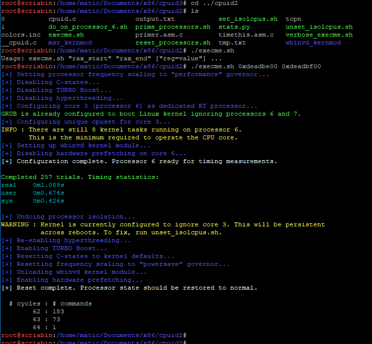

# MICROTIMER - side channel attacks against x86 microcode

This repository contains code to precisely time very small sets of x86 instructions, thereby measuring the number of x86 microinstructions run in that time.

Work needed to be done:
- Documentation is almost non-existent, needs to be fleshed out.
- Kernel-mode arbitrary instruction execution module (msr\_kernmod) is fleshed out, but not integrated into the main functionality.
- Threat modelling needs to be performed on other creative ways to use this timing attack. Superficially not much is to be found in the cpuid fuzzing (used by execme.sh by default), but like xoreaxeaxeax's rosenbridge backdoor discovery, the x86 architecture is a wild west.
- Right now, this repo works specifically and only with an ivy bridge i7 8-core processor. The steps taken by the script should be generalized to work on any processor.

## Usage

Try running execme.sh, and ideally, your output should look something like this:

